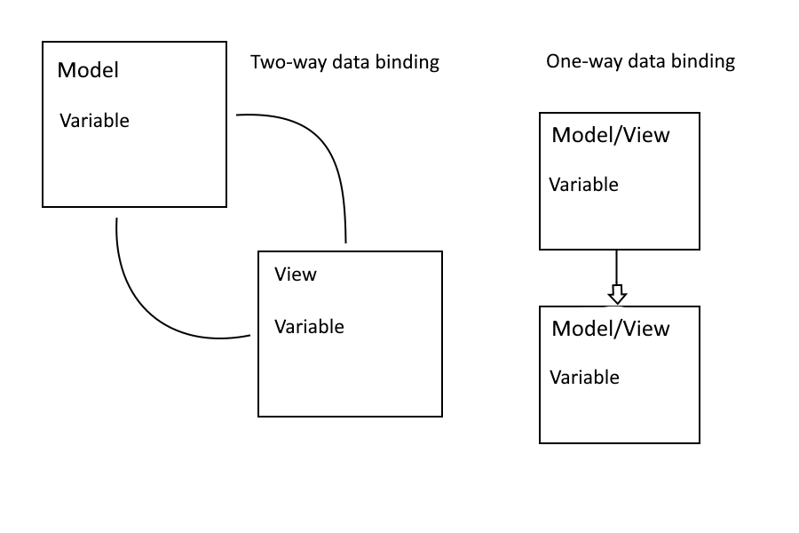

# AngularJS Data Binding : Description

## References

[AngularJS Data Binding (Official Docs)](https://docs.angularjs.org/guide/databinding#data-binding-in-angularjs-templates)

## What is data binding?

> ✒️ **Definition:** Data binding is the process by which variables in the Model are synced with the View within the MVC architecture.

Data binding works in either a 1-way or 2-way configuration.



- In a two-way configuration, if a change is made to a variable within the view, such as with an input element, then the variable will also also be changed within the Model. Likewise if the variable is changed within the Model, the new value will be reflected in the View. 
- In a one-way configuration, as its name implies, data only travels one way. Meaning that a change in a variable within the View/Model will change its corresponding value in the View/Model, but not vice versa. 

## How do we use data binding?

We've already been using data binding, although we never defined it as such. Here is an example of two-way data binding:

```html

<!doctype html>
<html ng-app>
  <head>
    <script src="https://ajax.googleapis.com/ajax/libs/angularjs/1.8.2/angular.min.js"></script>
  </head>
  <body>
    <div>
      <label>Name:</label>
      <input type="text" ng-model="yourName" placeholder="Enter a name here">
      <hr>
      <h1>Hello {{yourName}}!</h1>
    </div>
  </body>
</html>

```

Look familiar? It's our example from the very first topic. The `ng-model` directive is two-way binding the `yourName` variable from our Model to the input element. So in short:

1. The user types into the input element.
2. This updates the value of `yourName` in the Controller, and thus our Model as well. 
3. The value of `yourName` in the Model has changed so the expression on line 11 gets updated.

How about one-way data binding? This requires a bit more explanation of the Controller and Model in our MVC architecture. So far, we've been initializing variables and binding variables implicitly within our HTML markup - without any explicit Controller or Model. Below is an example of an explicit Controller, with a Model, that is nested inline within our HTML document. It's also an example of one-way data binding:

```html

<!doctype html>
<html ng-app="myApp" ng-controller="myCtrl">
  <head>
    <script src="https://ajax.googleapis.com/ajax/libs/angularjs/1.8.2/angular.min.js"></script>
  </head>
  <body>
    <h1>{{firstname}}</h1>

    <script>
        var app = angular.module('myApp', []);
        app.controller('myCtrl', function($scope) {
        $scope.firstname = "John";
        });
    </script>
  </body>
</html>

```

We will discuss Controllers and Models more in depth in a separate topic. For now, just take note of the one-way nature of this data binding example. The `firstName` variable in our Controller is set to 'John'. This is what will be rendered within the expression on the `<h1>` element.

## Why is data binding important?

We've already given justification for one-way data binding in our topic on expressions. But just to recap: It's way easier to dynamically render content with an expression, and thus one-way data binding, than it is to write up a bunch of JavaScript to achieve the same functionality. 

Similarly, two-way data binding also makes ours lives as programmers much easier. The `ng-model` directive could be used to take input from the user, dynamically change a variable in the Model, use that value in an operation, and then generate and return a unique value back to the View. That's a lot of functionality for very little code! Neat!