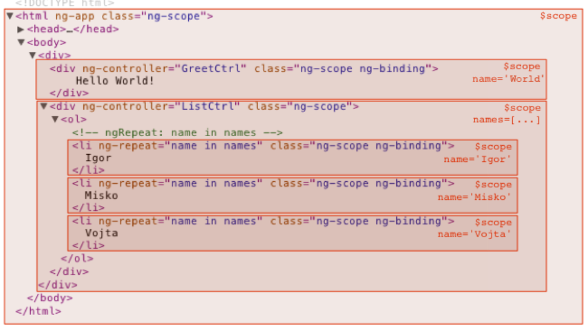

# Cumulative for Angularjs Controllers and Scopes

<details><summary>Prerequisites and Learning Objectives</summary>

# Prerequisites

Before going through this topic, the learner should have completed/understand the following:

- Able to create a boilerplate AngularJS app
- Knowledge of expressions and data binding

# Learning Objectives

At the end of the topic, the learner should be able to do the following:

- Describe an AngularJS Controller
- Use an AngularJS Controller either inline or through a separate file
- Create variables and functions inside a scope
- Describe a scope and understand scope inheritance

</details>

<details><summary>Description</summary>

## References

[AngularJS Controllers (Official Docs)](https://docs.angularjs.org/guide/controller)

[AngularJS Scopes (Official Docs)](https://docs.angularjs.org/guide/scope)

## What are Controllers and Scopes?

> ✒️ **Definition:** AngularJS Controllers define the states and behaviors of an AngularJS application - they control data.

In most of our previous examples, we've never defined an explicit Controller. An AngularJS Controller can either be inline or a separate file. We will see how to do both in the following section.

> ✒️ **Definition:** Scopes are the glue that hold the View and Controller together and they are the application Model in our MVC architecture. 

When we define a Controller, as we will soon see, we pass in a $scope object as a reference for that Controller. The $scope has access to all the application variables and methods that are accessed by both the View and the Controller.

> ✋ **Important:** In future topics we will see a better way to access the scope and add or manipulate data within it. 

## How to use Controllers and Scopes?

Here is an example of an inline Controller with its $scope:

```html 

<!doctype html>
<html ng-app="myApp" ng-controller="myCtrl">
    <head>
        <script src="https://ajax.googleapis.com/ajax/libs/angularjs/1.8.2/angular.min.js"></script>
    </head>
    <body>

        <div>

        Name: <input type="text" ng-model="name"><br>
        Age: <input type="text" ng-model="age"><br>
        <br>
        Name: {{ name }} Age: {{ age }}

        </div>

        <script>
        var app = angular.module('myApp', []);
        app.controller('myCtrl', function($scope) {
        $scope.name = "John Doe";
        $scope.age = 34;
        });
        </script>
    </body>
</html>
```

Ignore the ng-app and module for now, we will discuss that in another topic. But *do* notice the ng-controller directive. See how it's referencing the name given for the Controller here?

```javascript
 app.controller('myCtrl', function($scope) {
```

In fact, this is the line where we define our Controller and pass in the $scope object. The first parameter dictates the name of the controller. The last parameter is an anonymous function with the variables and functions of our app. In this case, we are only defining variables within our scope. To define a function, check out this example:

```html

<!doctype html>
<html ng-app="myApp" ng-controller="myCtrl">
    <head>
        <script src="https://ajax.googleapis.com/ajax/libs/angularjs/1.8.2/angular.min.js"></script>
    </head>
    <body>

         <div>

        Name: <input type="text" ng-model="name"><br>
        Age: <input type="text" ng-model="age"><br>
        <br>
        {{ myFunc() }}

        </div>

        <script>
        var app = angular.module('myApp', []);
        app.controller('myCtrl', function($scope) {
        $scope.name = 'John Doe';
        $scope.age = 34;
        $scope.myFunc = function() {
            return "Name: " + $scope.name + " Age: " + $scope.age;
        }
        });
        </script>
    </body>
</html>

```

With each keystroke our two-way data binding is changing the values of the name and age variables, thus re-evaluating our expression and the myFunc() function.

To recap what we know so far: 

1. The View is our HTML, it represents what the user sees.
2. The Controller defines the states and behaviors of an AngularJS application - they control data.
3. The Model is the variables and methods available to the current View and Controller, this is our $scope.

As mentioned earlier, $scope is actually a JavaScript object that contains variables and methods that can be accessed by both the Controller and the View. So you could say that the following code both defines our Controller and application Model in one fell swoop:

```javascript

app.controller('myCtrl', function($scope) {
        $scope.name = 'John Doe';
        $scope.age = 34;
        $scope.myFunc = function() {
            return "Name: " + $scope.name + " Age: " + $scope.age;
        }
        });

```

It is important to recognize and know which scope you are working with at any given time. For example, the following code actually has *two* ng-controller directives, each with their own separate scope. They each will only have access to their own scope. 

> ✋ **Important:** Some directives will also create their own scope! Such as ng-repeat!

```html

<!doctype html>
<html ng-app="myApp">
    <head>
        <script src="https://ajax.googleapis.com/ajax/libs/angularjs/1.8.2/angular.min.js"></script>
    </head>
    <body>

        <div ng-controller="myCtrl">

        Name: <input type="text" ng-model="name"><br>
        Age: <input type="text" ng-model="age"><br>
        <br>
        {{ myFunc() }}

        </div>

        <div ng-controller="myCtrl2">

          Name: <input type="text" ng-model="name"><br>
          Age: <input type="text" ng-model="age"><br>
          <br>
          {{ myFunc() }}
  
        </div>

        <script>
        var app = angular.module('myApp', []);
        app.controller('myCtrl', function($scope) {
        $scope.name = 'John Doe';
        $scope.age = 34;
        $scope.myFunc = function() {
            return "Name: " + $scope.name + " Age: " + $scope.age;
        }
        });

        app.controller('myCtrl2', function($scope) {
          $scope.name = 'Jane Doe';
          $scope.age = 30;
          $scope.myFunc = function() {
              return "Name: " + $scope.name + " Age: " + $scope.age;
          }
          });
        </script>
    </body>
</html>

```

We also have the concept of the rootScope. The rootScope is the top level scope over the entire application. Thus, our scope is either the root, or a child of the root or another separate scope. Scope inheritance is also applied. Meaning that child scopes have access to the data of their parents. 



Finally, let's wrap up this topic with how to use an external file as a Controller. This method is preferred over an inline implementation. This is because this makes our code more maintainable because there is a separation of responsibility. There isn't much to it. Simply use a `<script>` tag within your HTML markup to bring in the JavaScript content.

The HTML:

```html

<div ng-app="myApp" ng-controller="myCtrl">

First Name: {{ firstName }}
Last Name: {{ lastName }}

</div>

<script src="app.js"></script>

```

The External JavaScript file 'app.js' :

```JavaScript

  var app = angular.module('myApp', []);

  app.controller('myCtrl', function($scope) {
  $scope.firstName = 'John';
  $scope.lastName = 'Doe';
});

```

## Why are Controllers and Scopes important?

As you may have guessed, Controllers and Scopes are supremely important for the AngularJS framework. They are the Model and Controller within our MVC architecture. This separation of concerns let's us build modular, single page apps that feel and behave like an application running natively on the device. This provides a fast and fluid experience to the user. This is key in a competitive marketplace where users demand the best (and will quickly drop apps that under-perform).

</details>

<details><summary>Real-World Application</summary>

Luisa is continuing her studies of AngularJS. She has received the following assignment:

Demonstrate your knowledge of Controllers and Scopes by creating an application with the following criteria:

  - The application should have two Controllers within the HTML markup - one nested inside the other. 
  - The first Controller will be the parent and should contain two variables.
    - Name: John Doe
    - Age: 34
  - The second Controller will be a child of the first Controller and should contain only one variable.
    - Age: 30
  - Display this information using expression syntax. 

  Let's help out Luisa!

</details>

<details><summary>Implementation</summary>

- To begin, scaffold an AngularJS application.
- Next we should create the Controllers either inline or through an external file. 
- Add the variables to each of our Controllers.
- After that we should nest each of our Controllers using HTML markup. Your author would suggest using `<div>` elements.
- Finally, let's display the information using expression syntax. 
- Expand the solution below to check your work!

<details><summary>Solution</summary>

The index.html file:
```html

<!doctype html>
<html ng-app="myApp">
  <head>
    <script src="https://ajax.googleapis.com/ajax/libs/angularjs/1.8.2/angular.min.js" defer></script>
    <script src="app.js" defer></script>
  </head>
  <body>
    
    <div ng-controller="myCtrl">
      <h1>Name: {{ name }} Age: {{ age }}</h1>

      <div ng-controller="myCtrl2">
        <h1>Name: {{ name }} Age: {{ age }}</h1>
      </div> 

    </div>

  </body>
</html>

```

The app.js file:
```JavaScript

var app = angular.module('myApp', []);

app.controller('myCtrl', function($scope) {
    $scope.name = 'John Doe';
    $scope.age = 35;
});

app.controller('myCtrl2', function($scope) {
    
    $scope.age = 30;
});

```

</details>

## Exercises

- When the app we created is rendered, why is John Doe used twice? Why is the age in the second Controller set to 30 and not 35?

<details><summary>Answer</summary>

The name variable is being inherited from our parent Controller. This is why 'John Doe' is being shown in our second `<h1>` element. 

As for the age - the child controller has overwritten the value that was inherited from the parent Controller.

</details>

</details>

<details><summary>Summary</summary>

- AngularJS Controllers define the states and behaviors of an AngularJS application
  - Controllers can be defined inline or through an external JavaScript file
- Scopes are the glue that hold the View and Controller together and they are the application Model in our MVC architecture
  - The $scope object contains all the variables and methods available to the Controller and View
  - Scope data is only available to its own level within the DOM and any children scopes
  - The rootScope is the top level scope within the application

</details>

<details><summary>Practice Questions</summary>

[Practice Questions](./Quiz.gift)

</details>