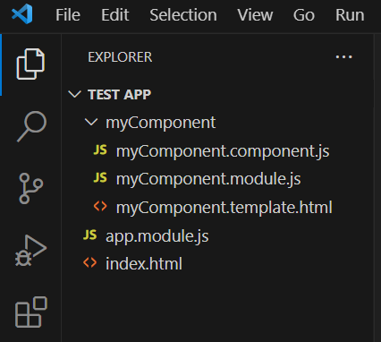
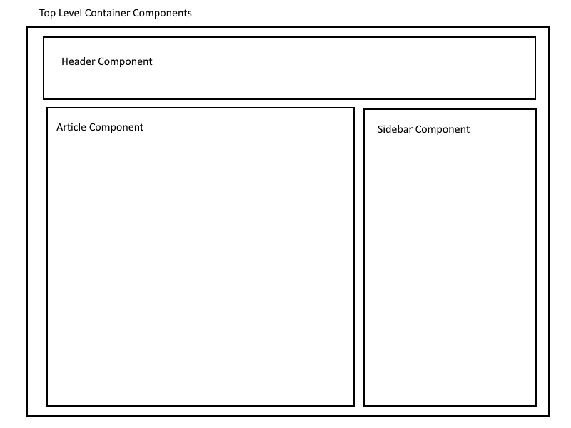
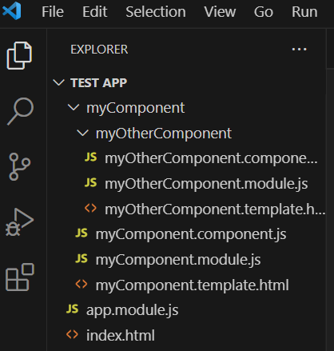

# AngularJS Modules and Components : Description

## References

[AngularJS Modules (Official Docs)](https://docs.angularjs.org/guide/module)

[AngularJS Components (Official Docs)](https://docs.angularjs.org/guide/component)

[AngularJS Tutorial for Modules, Components, and file organization (Official Docs)](https://docs.angularjs.org/tutorial/step_04)

## What are Modules and Components?

Thus far, we've been exploring AngularJS within the context of a single HTML file. This hardly provides for the modularity promised within a single page application. With our discussion of Modules and Components, we will begin to rectify that. Both Modules and Components allow us to containerize and organize our code as well as allow us to re-use code. These concepts will be essential for creating a single page application. In this lesson, we will also give recommendations on setting up a structure for our apps. This will help us ensure that our code is more maintainable and will scale as the project grows in scope. Finally we will discuss the process of nesting Components to create modular applications. 

> ✒️ **Definition:** Modules are used to bundle up and containerize the different parts of our application. 

> ✒️ **Definition:** Components are used to create reusable and modular sections of the user interface complete with business logic.

## How can we use Modules and Components?

Let's start with Modules. As mentioned previously, Modules help us containerize the different parts of our application. Many items can be included in a Module, including Controllers, Directives, and much more. 

We've been using Modules in most of our previous examples. But let's take a look at another example below:

Our index.html file:
```html

<!doctype html>
<html ng-app="myApp" ng-controller="myCtrl">
    <head>
        <script src="https://ajax.googleapis.com/ajax/libs/angularjs/1.8.2/angular.min.js" defer></script>
        <script src="app.js" defer></script>
    </head>
    <body>

        Name: {{ name }} Age: {{ age }}
    
    </body>
</html>

```

Our app.js
```JavaScript
var app = angular.module('myApp', []);
app.controller('myCtrl', function($scope) {
    $scope.name = 'John Doe';
    $scope.age = 30;
})

```

By now, you've probably surmised that the ng-app directive and the following line of code are related (and you'd be right!):

```JavaScript
var app = angular.module('myApp', []);
```

That line of code is all it takes to create a module. The first parameter in the `.module()` function is a string name for the module. The second parameter is a list of dependencies for that module (more on that soon). So as you have probably recognized, whenever we use the ng-app directive we are bootstrapping the module, and all of its contents, into our application. This includes our Controller as well. In our code whenever we call `app.controller(...)`, we are attaching that Controller to the Module.

Now that we have a conceptual understanding of Modules, and how to create them, let's discuss Components. As mentioned previously, Components allow us to bundle up re-usable sections of user interface with business logic. These Components will have their own HTML markup, Controller, and Module to neatly bundle the Component up. Let's take a look at the three necessary files that make up a Component:

This is the myComponent.module.js file:
```JavaScript
angular.module('myComponent', []);
```

Not much is new here, we are simply creating a Module to help us bundle up our Component. Here we have named the module 'myComponent' within the module function. You may have also noticed the file name ending in `module.js` - this is a recommended convention for Module definitions.

This is the myComponent.template.html file:
```html
<div >
    Name : {{ $ctrl.name }}
</div>
```

The biggest change here is the `$ctrl` syntax. When using this Component based design pattern, we may use `$ctrl` to get access to the values of variables within our Controller. This is preferred over directly accessing the `$scope`. The reason why is out of our scope for now. Also notice the `template.html` naming convention - this is strongly recommended. Going forward, you may hear the term 'template' to refer to the View - the HTML markup that makes up what the user sees. 

This is the myComponent.component.js file:
```JavaScript
angular
    .module('myComponent')
    .component('myComponent', {
        templateUrl: 'myComponent/myComponent.template.html',
        controller: function myComponentController() {
            this.name = 'John Doe';
        }
    });
```

Let's step through this code as well:

- `angular.module('myComponent')` is referencing the module we created earlier. 
- The `.component(...)` function is taking in two parameters. The first is the desired name for our Component. The second parameter is a `Component Definition Object (CDO)`.

The `CDO` takes in properties that define the View and Controller for a Component. As you may have noticed, the `templateUrl` property is pointing to the HTML markup that will make up our Component. The path of the `templateUrl` is relative to that of the 'index.html' file. The `controller` property contains a function that constitutes our Controller.

There is no need to pass in `$scope` to the Controller, the AngularJS framework will do the legwork. When we initialize variables or functions within our Controller, we *will* include the 'this' keyword. This will ensure that these variables and functions are associated with our Controller and underlying scope object.

That's all there is to setting up a basic component! It is recommended that these files are neatly stored in a folder within your project, preferably with the same name as the component. Here's an example:



But how do we use our shiny new Component? Well we need to bootstrap it into the top level html document. Traditionally, this is the 'index.html' file as seen above. Let's take a look at the 'index.html' file and the 'app.module.js' files:

index.html:
```html
<!doctype html>
<html ng-app="myApp">
    <head>
        <script src="https://ajax.googleapis.com/ajax/libs/angularjs/1.8.2/angular.min.js" defer></script>
        <script src="app.module.js" defer></script>
        <script src="./myComponent/myComponent.module.js" defer></script>
        <script src="./myComponent/myComponent.component.js" defer></script>
    </head>
    <body>

        <my-component></my-component>

    </body>
</html>
```

Take note at our `<script>` elements. We need to bring in all those JavaScript files. Every single module and every single component definition. This is admittedly a bit tedious - but it is required for everything to function. The order is important as well. Be sure to load all modules before bringing in the components associated with the modules. 

The other important thing to notice here is the `<my-component>` element. This is what tells the AngularJS framework to load the component of the same name. Notice how in the HTML template we are using a kebab-case convention, while everywhere else we use a camel-case naming convention. This is standard practice and highly recommended. 

app.module.js:
```JavaScript
angular.module('myApp', [
    'myComponent'
]);
```

In our 'app.module.js' file, as seen above, we define the name of the top level module in the first parameter. This is what we will bootstrap into our 'index.html' file with the ng-app directive. Then, in the second parameter, we will list any dependencies in an array. We want to use our 'myComponent' component within our app, so we will list it as a dependency. 

That's the basics of Modules and Components. However, we have one final topic to discuss - `Component Composition`. `Component Composition` refers to the nesting of components to build an application. Essentially, we use Components like lego pieces to assemble our entire app. We would traditionally have a container Component that sits at the top level and houses our entire application. Then, like a Russian nesting doll, we would have layers of nested Components that comprise our application. We may have a Component that contains the header for the webpage, a Component for an article, a footer, ect. Here is a rough illustration:



To nest one Component inside the other, simply include the child Component as a dependency of the parent Component. Then, include the child Component within the template of the parent. Example:

myComponent.template.html
```html
<div >
    Name : {{ $ctrl.name }}

    <my-other-component></my-other-component>
</div>
```

myComponent.module.js
```JavaScript
angular.module('myComponent', [
    'myOtherComponent'
]);
```

> ✋ **Important:** Don't forget to include all the `<script>` elements to bring all JavaScript files into the 'index.html'!

The structure of these files within the project folder is ultimately up to the developer. Your author likes to structure Component files by their relation to each other. For example, since 'myOtherComponent' is a child of 'myComponent', your author has organized the files like so: 



## Why are Modules and Components important?

Modules and Components are extremely important in the AngularJS framework because they allow us to create modular and scalable applications. They are modular because we can take any individual Component and re-use it wherever we need to. This saves time during development, and thus, makes our lives as developers easier. Modules and Components also help keep our applications scalable. Since our content is no longer static, and everything is neatly organized into Modules, developers can easily navigate to specific files for troubleshooting. 