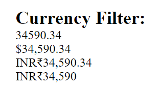

# Cumulative for Filters

<details><summary>Prerequisites and Learning Objectives</summary>

# Prerequisites

Before going through this topic, the learner should have completed/understand the following:

- Expressions
- Directives
- Modules and Components

# Learning Objectives

At the end of the topic, the learner should be able to do the following:

- Define AngularJS filters
- Implement common filters in an AngularJS application

</details>

<details><summary>Description</summary>

## References

[Filters (AngularJS Official Docs)](https://docs.angularjs.org/guide/filter)

[Built-In AngularJS Filters (Official Docs)](https://docs.angularjs.org/api/ng/filter)

## What are filters?

> ✒️ **Definition:** Filters are applied to expressions within a template and they alter the format of the data returned by the expression. 

Example syntax:
```JavaScript
{{ expression | filter}}
```

Filters may alter the format of expressions in many different ways. As an example we could ensure that an expression always renders as a currency, we could format the number of decimal places within a number, and we could even apply filters to arrays or objects to further organize the data. We have many filters that are ready to use and built right into the AngularJS framework, we may also create our own custom filters if needed.

## How can we use filters?

In this section we will discuss a few common built-in filters available to the AngularJS framework. We will work with numbers, dates, currencies, and 'filter' filters. This is by no means an exhaustive list, check the docs linked above to see them all. With that said, let's jump into the code:

Our template.html:
```html
<div class="container">
    <my-header></my-header>

    <div class="section">
        <h2>Currency Filter:</h2>
        <div>{{ $ctrl.currency }}</div>
        <div>{{ $ctrl.currency | currency }}</div>
        <div>{{ $ctrl.currency | currency:"INR₹" }}</div>
        <div>{{ $ctrl.currency | currency:"INR₹":0 }}</div>
    </div>

    <div class="section">
        <h2>Number Filter:</h2>
        <div>{{ $ctrl.negativeInfinity | number }} {{ $ctrl.infinity | number }}</div>
        <div>{{ $ctrl.number }}</div>
        <div>{{ $ctrl.number | number }}</div>
        <div>{{ $ctrl.number | number:0 }}</div>
        <div>{{ $ctrl.number | number:1 }}</div>
        <div>{{ $ctrl.number | number:2 }}</div>
    </div>

    <div class="section">
        <h2>Date Filter:</h2>
        <div>{{ $ctrl.date }}</div>
        <div>{{ $ctrl.date | date:"short" }}</div>
        <div>{{ $ctrl.date | date:"yyyy-MM-dd" }}</div>
        <div>{{ $ctrl.date | date:"HH:mm:ss" }}</div>
    </div>
    
    <div class="section">
        <h2>Array Filter:</h2>
        <label for="searchArray">Search and filter items in array:</label>
        <input type="text" id="searchArray" ng-model="query"/>

        <div ng-repeat="elem in $ctrl.myArray | filter:query">
            <p>{{ elem.name }} Phone Number: {{ elem.number }}</p>
        </div> 
    </div>
    
</div> 
```

Our component.js: 
```JavaScript
angular
    .module('container')
    .component('container', {
        templateUrl: 'container/container.template.html',
        controller: function containerController() {
            this.currency = 34590.34;
            this.date = new Date();
            this.infinity = Infinity;
            this.negativeInfinity = -Infinity;
            this.number = 4355.2145;
            this.myArray = [
                {name: 'Bob', number: '444-257-0842'},
                {name: 'Mark', number: '444-262-2892'},
                {name: 'Joe', number: '999-444-2452'}
            ];
        }
    });
```

Let's go from top to bottom starting with currencies. The code from above will render as follows:



As you may have noticed, the default for a currency filter without any modification is the USD format. We can change the format however by including additional arguments, each separated by a colon. The second argument in our example is the text with which you would like to prefix to the number. In our case, we went with Indian Rupees. The last parameter will specify the amount of decimal points. 

Our example of the number filter will render as follows:


The default number filter will limit any non-whole numbers to 3 decimal points. It will also use a North America based format for comma separation. We can of course change the desired number of decimal points in our second argument, separated with a colon. Another neat feature of this filter is that it will automatically print infinity symbols for `Infinity` or `-Infinity` JavaScript values.

Our third example with dates will render like so: 


Much like our previous examples, we use colon separated arguments to customize our filter. Here we have used a short formatted date, year-month-day format, and hours:minutes:seconds to provide a few examples. 

There are a lot of options for formatting dates with this filter, far too many to list here and it is extremely customizable. Your author recommends [peeking at the documentation](https://docs.angularjs.org/api/ng/filter/date) to see what all is available. 

Our last example is the 'filter' filter. This is perhaps a bit confusing, until you notice that it is simply a filter that uses the 'filter' keyword. This filter will create a new array based on search results from an existing array. 


In our example, the user may type into the input which will update the ng-model variable called 'query'. This variable is then passed as an argument to our filter. When a string is passed as an argument, the filter will search each element in the array and even look down at any object properties to retrieve a match. Any matches will be included within the new array. In the image above, the letter 'o' is both in 'Bob' and 'Joe', so both elements of the array are returned. 

## Why are filters important?

Filters, much like other AngularJS features, allow developers to get more done with less effort. Which would you rather do? Format a date in pure JavaScript? Or use a date filter to complete the same task with much less effort? Would you rather write a bunch of custom JavaScript to implement a search and sort feature? Or just let an array filter to the work? Your author will take the path of least resistance every time.

</details>

<details><summary>Real-World Application</summary>

Given a set of data, Luisa has been tasked with organizing that data in a specific manner. The data includes the names and account balance for a set of individuals. The name of each individual should appear next to their account balance, which in turn should be formatted in a standard USD format. Luisa has also been tasked with creating a filter for the data. Whenever the user enters a value into a text input, that information should be used to filter the records shown on screen. Let's help our Luisa!

</details>

<details><summary>Implementation</summary>

## Let's help Luisa!

- Here is the sample data for the challenge:

```JavaScript
this.data = [
                {name: 'Bob', balance: 3443.44},
                {name: 'Mark', balance: 343.22},
                {name: 'Joe', balance: 3890.74},
                {name: 'Kate', balance: 879.90},
                {name: 'Susan', balance: 12690.46},
                {name: 'Sophia', balance: 1389.77}
            ]
```

- We first need to scaffold our AngularJS application and set up any Components or Modules as necessary. Refer to previous lessons if you need a refresher.
- Next, make sure to include the sample data in the Controller. In a full stack application, this data would likely not be hardcoded but instead retrieved from a database. We will get to that point eventually!
- Next, we need to set up our template. We will need a text input to take in a query from the user. This will be used to filter the data from our original data set. Set an ng-model directive so we can work with the input.
- For the next step, your author recommends a `<div>` element with ng-repeat. We will use the 'filter' filter in tandem with the ng-repeat, taking in our variable from the input while we do so. This will allow us to filter the results by that query.
- Finally, wrapped inside the `<div>` with our ng-repeat, we need to print out the data from our data set. Include the name as well as the account balance. For the account balance, don't forget to format the data with the currency filter. 
- Check the demo folder in the topic files to check your work!

## Exercises

- Can the 'filter' filter only find matches via string values?

<details><summary>Answer</summary>

We can use strings, objects, and functions with the 'filter' filter. 

For example, if we use an object, we can narrow the focus of our search to specific properties in the object. 

Object example:
```html
<div class="section">
        <h2>Array Filter:</h2>
        <label for="searchArray">Search and filter items in array:</label>
        <input type="text" id="searchArray" ng-model="query"/>

        <div ng-repeat="elem in $ctrl.myArray | filter:{name: query}">
            <p>{{ elem.name }} Phone Number: {{ elem.number }}</p>
        </div> 
    </div>
```

</details>

</details>

<details><summary>Summary</summary>

- Filters are applied to expressions within a template and they alter the format of the data returned by the expression.
- There are ready to use pre-built filters in the AngularJS framework.
- We can make our own custom filters.
- In this lesson we discussed the following pre-build filters:
  - Currency - Used to format numbers into a desired currency format. The default is USD but this can be changed.
  - Number - This filter will format numbers into a North American layout with 3 decimal points. The decimal point precision may be customized.
  - Date - This filter will format JavaScript date objects and is very customizable.
  - 'Filter' filter - This filter will create a new array from an existing array based on a matching string, object, or function.

</details>

<details><summary>Practice Questions</summary>

[Practice Questions](./Quiz.gift)

</details>