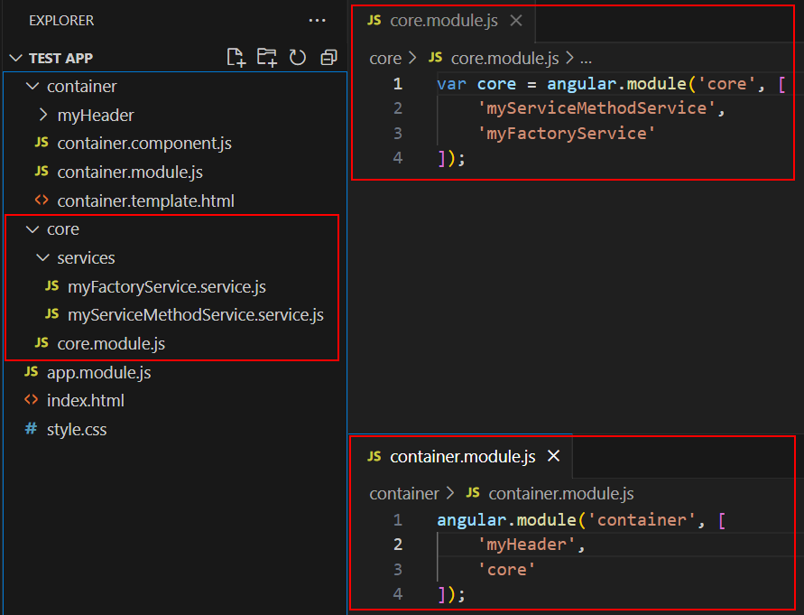

# Services and $http : Description

## References

[AngularJS Directives (Official AngularJS Docs)](https://docs.angularjs.org/guide/services)

[AngularJS Dependency Injection (Official AngularJS Docs)](https://docs.angularjs.org/guide/di)

## What are services?

> ✒️ **Definition:** Services in AngularJS are used to share code across our applications via dependency injection.

> ✒️ **Definition:** Dependency injection is the process by which AngularJS components retrieve services, custom directives, and more items needed to function via the AngularJS Injector Subsystem. 

Services may at first glance sound very similar to components or modules. After all, components and modules are also a way to share and reuse code within our applications. The difference between a service and a component is that a service will not have any view associated with it. Services are simply functions (logic) and variables (data) that we can share across an app. The difference between a service and a module is that a service defines functions and variables while a module bundles up components, services, and more. That is the only purpose for a module, bundling and sharing various items - it doesn't define the items themselves.  

There are a few ways we may create services in the AngularJS framework. Each option has different syntax and behaves slightly different. 

- The Service method
- The Factory method
- The Provider method

In this lesson, we will discuss the first two options. We will also discuss the built-in $http service. Much like how we have built-in directives or filters, we also have built-in services. The $http service assists us with easily making requests to web APIs. To wrap up this lesson, we will also discuss how to organize services within our project.

## How can we use services?

### Factory Service Method and Dependency Injection

Let's begin with an example of a factory service.

myFactoryService.service.js:
```JavaScript
var myFactoryServiceModule = angular.module('myFactoryService', []);

myFactoryServiceModule.factory('myFactoryServiceId', function() {

    var serviceObject = {}

    serviceObject.myServiceFunction = function() {
       return 'this prints from my factory service!'; 
    };
    
    return serviceObject;
});
```

It is a best practice to separate each piece of functionality within our app. So much like how components will get their own module, so too will services. We typically define the module and service in a single file. The convention is to end the file name with 'service.js'. 

With factory service methods, our functions and variables are bundled up into a service object. Whenever a component makes use of our service, the entire object is returned. As the name 'factory' implies, we are getting an instantiation of the service each time it is injected via dependency injection. In our 'component.js' file below, let's explore dependency injection. 

container.component.js:
```JavaScript
angular
    .module('container')
    .component('container', {
        templateUrl: 'container/container.template.html',
        controller: ['myFactoryServiceId', function(myFactoryServiceId) {
            
            var self = this;
            self.factoryServiceMessage;

            self.myFunc = function() {
                self.factoryServiceMessage = myFactoryServiceId.myServiceFunction();
            }
        }]  
    });
```

For brevity, we will omit the 'template.html' and simply walk through the code. The full project file will be provided in the topic files. To begin, let's walk through the new syntax. 

The following is an example of dependency injection. We have already imported our 'service.js' file into the main 'index.html', along with all other JavaScript files used by the application. So in our array where we define the controller, we first list out all dependencies for this component. 'myFactoryServiceId' is the original name given to the service via our `.factory()` method. The array ends with the function that contains the logic for our controller. We pass in an instance of our dependency to this controller as well. The arguments, if there are multiple, are passed in the same order by which we defined the dependencies earlier in the array. There are a few different syntax options for dependency injection. This is the preferred way as the code will not break if minified. 

```JavaScript
controller: ['myFactoryServiceId', function(myFactoryServiceId) {
```

Because our function that defines our controller is an anonymous function and because we will likely have further anonymous functions nested inside, it is common to redefine 'this'. Redefining 'this' into another variable, such as 'self', can help avoid scoping issues.

Whenever a user clicks a button in the template, the 'myFunc' function will trigger in our controller. At that point, we simply call the 'myServiceFunction' in our service which returns our text value. This value is then placed into our variable in the controller which will display in the template. 

```JavaScript
    var self = this;
    self.factoryServiceMessage;

    self.myFunc = function() {
        self.factoryServiceMessage = myFactoryServiceId.myServiceFunction();
    }
```

### Creating Services via the Service method

Now let's see an example of the service method creating a service!

myServiceMethodService.service.js:
```JavaScript
var serviceModule = angular.module('myServiceMethodService', []);

serviceModule.service('myServiceMethodService', function() {

    var self = this;
    self.username = 'johndoe1337@fakemail.com';
    self.message;

    self.myFunc = function() {
        self.message = 'This prints from my service using the service method!';
    }


});
```

The first thing you may notice from using the service method is that nothing is ever returned. Services created from the `.service()` method, unlike `.factory()` do not create an instantiation for each dependency injection. Rather, via the service method, a singleton is created. This means that one instance of the service is used for all components who make use of it. Other than that, the syntax is very similar to the factory method. Below, we have added this service to the 'container.component.js' file. When the user clicks a button in the template, the 'myFunc' function is executed and the message variable is set and displayed. The username will also be displayed in the template as soon as the component loads into the DOM. Notice that via the service method we need to execute the function and then retrieve the message variable in the service. This is because the service method can not return anything!

> ✋ **Important:** Because of the mechanism we just mentioned, services created via the service method are ill suited to asynchronous code. Services created via the factory method can handle asynchronous code just fine. For example, you could chain a `.then()` method to handle promises via the factory method. 

container.component.js:
```JavaScript
angular
    .module('container')
    .component('container', {
        templateUrl: 'container/container.template.html',
        controller: ['myFactoryServiceId', 'myServiceMethodService', function(myFactoryServiceId, myServiceMethodService) {
            
            var self = this;
            self.username = myServiceMethodService.username;
            self.factoryServiceMessage;
            self.methodServiceMessage;

            self.myFunc = function() {
                self.factoryServiceMessage = myFactoryServiceId.myServiceFunction();
                myServiceMethodService.myFunc();
                self.methodServiceMessage = myServiceMethodService.message;
            }
        }]  
    });
```

### The $http Service

Finally, let's see a pre-built service in action - the $http service. We will simply add code to our 'container.component.js' to showcase this feature.

```JavaScript
angular
    .module('container')
    .component('container', {
        templateUrl: 'container/container.template.html',
        controller: ['myFactoryServiceId', 'myServiceMethodService', '$http', function(myFactoryServiceId, myServiceMethodService, $http) {
            
            var self = this;
            self.username = myServiceMethodService.username;
            self.factoryServiceMessage;
            self.methodServiceMessage;
            self.joke;

            self.myFunc = function() {
                self.factoryServiceMessage = myFactoryServiceId.myServiceFunction();
                myServiceMethodService.myFunc();
                self.methodServiceMessage = myServiceMethodService.message;

    
                $http({
                    method: 'GET',
                    url: 'https://api.chucknorris.io/jokes/random?category=dev'
                  }).then(function successCallback(response) {
                      // this callback will be called asynchronously
                      // when the response is available
                        self.joke = response.data.value;
                    }, function errorCallback(response) {
                      // called asynchronously if an error occurs
                      // or server returns response with an error status.
                    });

            }
        }]  
    });
```

As you may have already noticed, we simply include the $http service via dependency injection, just like our other services. We can then use the $http method and set the http method property and url before chaining a `.then()` method to handle the response, wether that be a success or error. In this case, we are getting a random joke from an API. This joke is placed into our `self.joke` controller variable, where it will be displayed in the template.

### A Note on Project Structure 

Let's wrap up this topic with a discussion on project structure. It is common to roll up custom directives, filters, and services into a module to bundle up all of that functionality. This let's us easily import all of these items into components if needed. In the example below, we have created a 'core' module to hold all of our services. We've done so by adding our services as dependencies to the 'core' module. We can then simply use 'core' as a dependency in our 'container.module.js' to import all our services and make them available for the 'container' component. 



## Why are services important?

The usefulness of services can not be understated. One of the most basic principles of good programming is the keep your code DRY. DRY as in: Don't Repeat Yourself. Services help us achieve this by allowing us to reuse code within our applications. Instead of writing a similar function 20 different times, create a service with that function and use it instead! Of course the built-in services are very useful as well. It doesn't get much easier to handle http requests with the $http service!